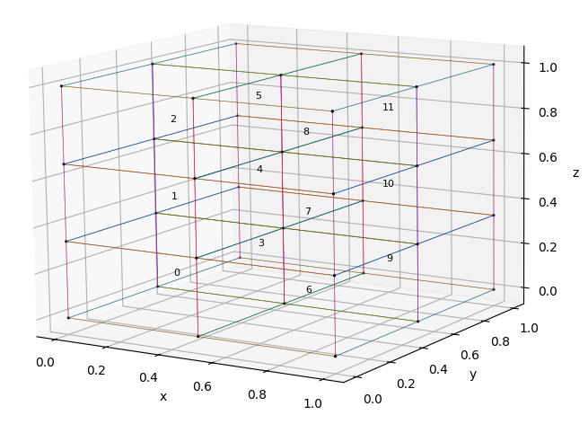
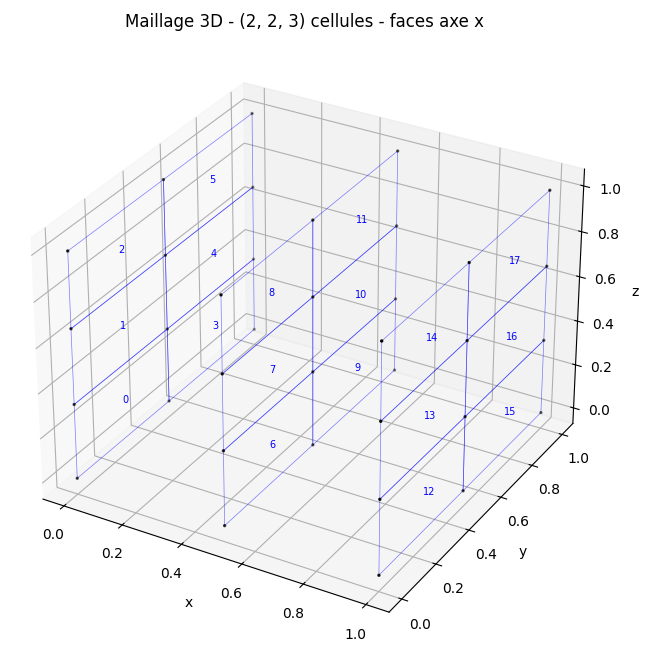
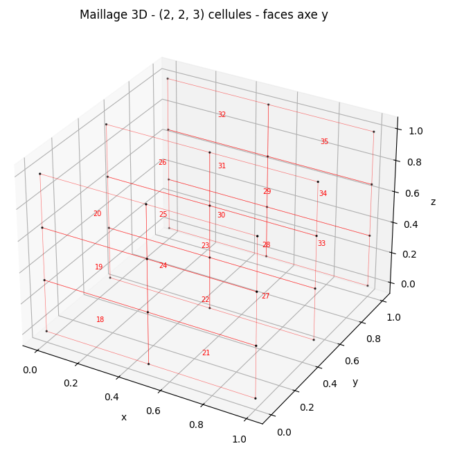
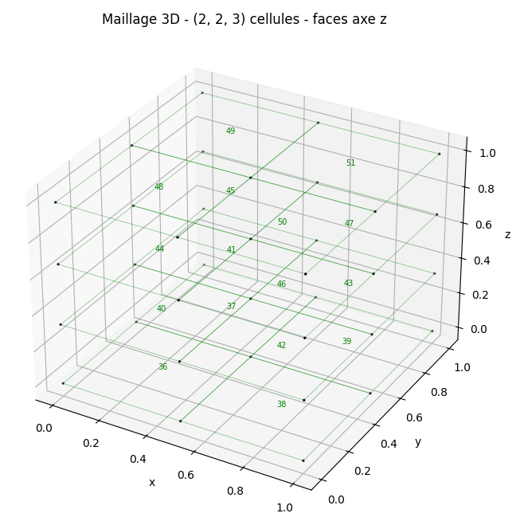

# Implémentation : Branche `scimba_jax_dg`

Dans ce fichier, on présente l'implémentation commune aux deux méthodes : FEM et DG. Deux fichiers supplémentaires (`fem_implementation.md` et `dg_implementation.md`) détaillent les spécificités de chacune.

On retrouve une description détaillée de toutes les notations utilisées dans le fichier `notations.md`.

On se place dans le contexte où on travaille **sur un seul "patch"** divisé en plusieurs cellules. L'élargissement à des domaines composés de plusieurs patchs sera abordée par la suite.

## 1. Mapping

> src/scimba_jax/mapping/mapping.py

### Description

Le mapping $g$ est utilisé pour transformer les points de quadrature du domaine logique $[0,1]^d$ vers le domaine physique $\Omega$ via $X = g(\xi)$ avec $\xi$ un point logique et $X$ son image dans le domaine physique. 

Un `Mapping` est une composition ordonnée de mapping :

$$g(\xi) = g_m \circ g_{m-1} \circ \cdots \circ g_1(\xi)$$

avec $m$ le nombre de fonctions composées où chaque $g_j$, $j \in \{1, \ldots, m\}$, est un mapping inversible d'un des deux types suivants :

| Type | Description |
|---|---|
| `InvertibleFunction` | Mapping inversible analytique |
| `InvertibleNet` | Réseau inversible du module Equinox (`eqx.Module`) |

On suppose donc que chaque mapping $g_j$ est inversible.

L'application inverse de $g$ est donc donnée par :

$$g^{-1}(X) = g_1^{-1} \circ g_2^{-1} \circ \cdots \circ g_m^{-1}(X).$$

### Calcul du Jacobien

Notons $y_0 = \xi$ et $y_j = g_j(y_{j-1})$, $j \in \{1, \ldots, m\}$ les points intermédiaires issus de l'application successive des fonctions composées.

Le Jacobien de la composition $g = g_m \circ \cdots \circ g_1$ est obtenu par la règle de la chaîne :

$$J_g(\xi) = J_{g_m}(y_{m-1}) \cdot J_{g_{m-1}}(y_{m-2}) \cdot \ldots \cdot J_{g_1}(y_0)$$

De même, le Jacobien de l'inverse $g^{-1} = g_1^{-1} \circ \cdots \circ g_m^{-1}$ est calculé par la même règle de la chaîne, mais dans l'ordre inverse :

$$J_{g^{-1}}(X) = J_{g_1^{-1}}(y_1) \cdot J_{g_2^{-1}}(y_2) \cdot \ldots \cdot J_{g_m^{-1}}(y_m)$$

On en déduit que le déterminant du Jacobien de la composition est le produit des déterminants des Jacobien intermédiaires :

$$|\det J_g(\xi)| = \prod_{j=1}^m |\det J_{g_j}(y_{j-1})|$$

et de même pour l'inverse :

$$|\det J_{g^{-1}}(X)| = \prod_{j=1}^m |\det J_{g_j^{-1}}(y_j)|$$

### Enregistrement comme pytree JAX

`Mapping` est enregistré comme pytree jax avec les attributs suivants :
- `children` : les `InvertibleNet` (apprenables, mis à jour par l'optimiseur)
- `aux_data` : les `InvertibleFunction` statiques (non différentiables au sens pytree)

## 2. Quadrature

> src/scimba_jax/linear_approximation/quad/gauss_quad.py

### Description

La classe `UnitSquareTensorized` construit une quadrature par produit tensoriel sur l'hypercube de référence $K_\text{ref} = [0,1]^d$.

$$ \int_{K_\text{ref}} f(\hat{\xi})\, d\hat{\xi} \approx \sum_{i=1}^{n_{\text{quad}}} w_i\, f(\hat{\xi}_i) $$

où $n_{\text{quad}} = q^d$ est le nombre total de points de quadrature volumiques avec $q$ l'ordre de quadrature, $w_i$ et $\hat{\xi}_i$ sont les poids et les points de quadrature.

De la même manière, elle construit une quadrature par produit tensoriel sur toutes les faces de l'élément de référence. Pour la suite, on s'intéressera uniquement aux faces "gauche/basse" de chaque direction. Pour cela, on va définir une face de référence $F_{\text{ref},\ell}$ pour chaque direction $\ell\in\{0, \ldots, d-1\}$, correspondant à l'hyperplan de $K_\text{ref}$ où la $\ell$-ème coordonnée est fixée à $0$, autrement dit :
$$F_{\text{ref},\ell} = \{\hat{\xi} = (\hat{\xi}_0, \hat{\xi}_1, \ldots, \hat{\xi}_{d-1}) \in [0,1]^d : \hat{\xi}_\ell = 0\}$$
Ainsi, pour une face $F_{\text{ref},\ell}$ de référence associée à la direction $\ell$, la quadrature par produit tensoriel est donnée par :

$$ \int_{F_{\text{ref},\ell}} f(\hat{\xi})\, d\hat{\xi} \approx \sum_{i=1}^{n_{\text{quad}}^s} w_i^s\, f(\hat{\xi}_{\ell,i}^s) $$

où $n_{\text{quad}}^s = q^{d-1}$ est le nombre total de points de quadrature surfaciques pour une face de référence (nombre indépendant de $\ell$), $\hat{\xi}_{\ell,i}^s$ sont les points de quadrature surfacique et $w_i^s$ les poids de quadrature surfacique (également indépendants de $\ell$).

### Construction des points et poids

Actuellement, deux variantes de règles de quadrature 1D (remappés de l'intervalle $[-1,1]$ à $[0,1]$) sont disponibles : Gauss-Legendre et Chebyshev. 

Ces points et poids 1D sont ensuite tensorisés pour construire les points et poids volumiques et surfaciques sur l'hypercube de référence. Plus précisément, les points volumiques sont construits par le produit tensoriel des points 1D dans chaque direction, et les poids volumiques sont le produit des poids 1D correspondants. Pour les points surfaciques, on fixe une coordonnée normale à $0$ ou $1$ (dans la suite, on utilise $0$) et on construit un produit tensoriel $(d-1)$-dimensionnel dans les directions tangentes.

> **Note :** Pour un ordre de quadrature $q$, les polynômes de Gauss-Legendre permettent d'intégrer exactement les polynômes de degré jusqu'à $2q-1$.

### Dimensions des tenseurs

* `points_1d`, `weights_1d` : $(q,)$, $(q,)$
* `volumic_points`, `volumic_weights` : $(n_\text{quad},\, d)$, $(n_\text{quad},)$
* `surfacic_points`, `surfacic_weights` : $(2d,\, n_\text{quad}^s,\, d)$, $(2d,\, n_\text{quad}^s)$

## 3. Maillage

> src/scimba_jax/linear_approximation/meshes/mesh.py

### Description

On définit un maillage uniforme $\mathcal{T}_h$ sur l'espace logique $[0,1]^d$, découpé en $N_\ell$ cellules dans la direction $\ell \in \{0, \ldots, d-1\}$ où $h$ représente la taille caractéristique du maillage.

On définit $N_\text{cells} = (N_0, \ldots, N_{d-1})$ comme le tuple du nombre de cellules par direction et $n_\text{cells} = \prod_{\ell=0}^{d-1} N_\ell$ comme le nombre total de cellules. 

Chaque cellule $K_c$ (où $c$ est l'indice de la cellule), définie comme un hypercube de taille $1/N_\ell$ dans la direction $\ell$, peut être identifiée par deux représentations équivalentes :

| Indexation | Notation | Valeurs | Conversion |
|---|---|---|---|
| Plate (`fidx`) | $c \in [0, n_\text{cells} - 1]$ | entier | `_midx_to_fidx` |
| Multi-dim (`midx`) | $\bar{c}(c) = (\bar{c}_0, \ldots, \bar{c}_{d-1})$ avec $\bar{c}_\ell \in \{0,\dots,N_\ell - 1\}$ | tuple de taille $(d,)$ | `_fidx_to_midx` |

> **Exemple :** pour un maillage 3D avec $N_\text{cells} = (2, 2, 3)$ cellules.
> 
> 
>
> - $c=0$ (première cellule) $\rightarrow \bar{c}(0) = (0, 0, 0)$
> - $c=11$ (dernière cellule) $\rightarrow \bar{c}(11) = (1, 1, 2)$

**Faces :** Les faces sont des hypersurfaces $(d-1)$-dimensionnelles, organisées en $d$ groupes selon leur axe normal. Les faces du groupe $\ell$ sont perpendiculaires à cette même direction ce qui signifie que chaque couche (correspondant à une position fixée sur l'axe $\ell$) contient $\prod_{j \neq \ell} N_j$ faces. Comme il y a $N_\ell + 1$ couches dans chaque groupe $\ell$, on a au total $n_{f,\ell}$ faces dans le groupe $\ell$, défini par :

$$n_{f,\ell} = (N_\ell + 1) \cdot \prod_{j \neq \ell} N_j$$

Ainsi le nombre total de faces est la somme sur les groupes :

$$n_\text{faces} = \sum_{\ell=0}^{d-1} n_{f,\ell} = \sum_{\ell=0}^{d-1} (N_\ell + 1) \cdot \prod_{j \neq \ell} N_j$$

> **Exemple :** pour le même maillage 3D avec $N_\text{cells} = (2, 2, 3)$ cellules.
> - $\ell = 0$ (axe $x$) : $\quad n_{f,0} = (2+1) \cdot (2 \cdot 3) = 18$ faces $\quad$ (bleu)
> - $\ell = 1$ (axe $y$) : $\quad n_{f,1} = (2+1) \cdot (2 \cdot 3) = 18$ faces $\quad$ (rouge)
> - $\ell = 2$ (axe $z$) : $\quad n_{f,2} = (3+1) \cdot (2 \cdot 2) = 16$ faces $\quad$ (vert)
> - total : $n_\text{faces} = 18 + 18 + 16 = 52$ faces
> 
>   

De manière équivalente aux cellules, chaque face $F_k$ (où $k$ est l'indice de la face) peut être identifiée par deux représentations équivalentes :

| Indexation | Notation | Valeurs | Conversion |
|---|---|---|---|
| Plate (`face_fidx`) | $k \in [0, n_\text{faces} - 1]$ | entier | / |
| Multi-dim (`face_midx`) | $\bar{k}(k) = (\ell; \bar{k}_0, \ldots, \bar{k}_{d-1})$ | tuple de taille $(d+1,)$ |  `_face_fidx_to_face_midx_and_face_type` |
| | avec  $\bar{k}_\ell \in \{0, \ldots, N_\ell\}$ et $\bar{k}_j \in \{0, \ldots, N_j - 1\}$ pour $j \neq \ell$ | | |

> **Exemple :** pour le même maillage 3D avec $N_\text{cells} = (2, 2, 3)$ cellules.
> - $k=0$ (première face du groupe $\ell=0$) $\rightarrow \bar{k}(0) = (0; 0, 0, 0)$
> - $k=17$ (dernière face du groupe $\ell=0$) $\rightarrow \bar{k}(17) = (0; 2, 1, 2)$
> - $k=18$ (première face du groupe $\ell=1$) $\rightarrow \bar{k}(18) = (1; 0, 0, 0)$

Les faces sont ensuite classées en deux catégories :
- **Internes** (`internal_faces_idx`) : couches intermédiaires ($1 \leq$ position $\leq N_\ell - 1$), partagées par deux cellules. 
- **Externes** (`external_faces_idx`) : première et dernière couche (position $0$ et $N_\ell$), faces de bord.

> **Note :** Si $N_\ell = 1$ dans une direction, il n'y a aucune face interne dans le groupe $\ell$.

La fonction `_face_fidx_to_neighbors_fidx` retourne les indices plats des deux cellules voisines d'une face. Pour les faces de bord, le voisin extérieur est encodé par une valeur négative.

### Chaîne de mapping

On va définir ici deux chaînes de mapping (volumique et surfacique) pour transformer les points de quadrature de l'élément de référence ou de la face de référence vers le domaine physique.

#### Mapping volumique

On note $T_{K_c} : K_\text{ref} \to K_c$ la transformation affine qui envoie l'élément de référence sur la cellule $K_c$ :

$$\xi = T_{K_c}(\hat{\xi}) = \frac{\hat{\xi} + \bar{c}(c)}{N_\text{cells}}, \qquad \hat{\xi} = T_{K_c}^{-1}(\xi) = \xi \cdot N_\text{cells} - \bar{c}(c)$$

où la division et la multiplication se font composante par composante.

Les points de quadrature volumiques traversent alors trois espaces successifs :

$$\hat{\xi} \in K_\text{ref} = [0,1]^d \xrightarrow{\ T_{K_c}\ } \xi \in K_c \subset [0,1]^d \xrightarrow{\ g\ } X \in \Omega$$

Autrement dit, les points de quadrature sont d'abord transformés de l'élément de référence à la cellule correspondante du maillage logique (via une transformation affine), puis du maillage logique au domaine physique via le mapping $g$.

La première flèche est réalisée par `_unit_hypercube_to_cell`, la seconde par `mapping.local_mapping`.

> **Remarque :** En développant composante par composante, on a pour la $j$-ème composante :
> $$(T_{K_c}(\hat{\xi}))_j = \frac{\hat{\xi}_j + \bar{c}_j}{N_j}$$
> Son jacobien est donc une matrice diagonale (constante par rapport à $\hat{\xi}$) :
> $$J_{T_{K_c}} = \text{diag}\left(\frac{1}{N_0}, \frac{1}{N_1}, \ldots, \frac{1}{N_{d-1}}\right)$$
> Et son déterminant (constant par rapport à $\hat{\xi}$) est donc :
> $$|\det J_{T_{K_c}}| = \prod_{j=0}^{d-1} \frac{1}{N_j} = \frac{1}{n_\text{cells}}$$

#### Mapping "surfacique"

Pour les faces, on procède de manière analogue. On note $T_{F_k} : F_{\text{ref},\ell} \to F_k$ la transformation qui envoie la face de référence sur la face $F_k$ (associée au groupe $\ell$) :

$$\xi = T_{F_k}(\hat{\xi}) = \frac{\hat{\xi} + \bar{k}(k)_{1:}}{N_\text{cells}}$$

avec $\bar{k}(k)_{1:} = (\bar{k}_0, \ldots, \bar{k}_{d-1})$ obtenu en omettant la composante $\ell$ et où la division et la multiplication se font également composante par composante.

Les points de quadrature surfaciques (vivant dans un hyperplan de l'espace volumique) traversent alors trois espaces successifs :

$$\hat{\xi} \in F_{\text{ref},\ell} \subset [0,1]^d \xrightarrow{\ T_{F_k}\ } \xi \in F_k \subset [0,1]^d \xrightarrow{\ g\ } X \in \Omega$$

Comme pour le mapping volumique, les points de quadrature sont d'abord transformés de la face de référence à la face correspondante du maillage logique (via une transformation affine), puis du maillage logique au domaine physique via le mapping $g$.

La première flèche est réalisée par `_unit_hyperplane_to_face`, la seconde par `mapping.local_mapping`.

> **Remarque :** En développant composante par composante, on a pour la $j$-ème composante :
> $$(T_{F_k}(\hat{\xi}))_j = \frac{\hat{\xi}_j + \bar{k}_j}{N_j}$$
> Son jacobien (en tant que mapping $[0,1]^d \to [0,1]^d$) est une matrice diagonale :
> $$J_{T_{F_k}} = \text{diag}\left(\frac{1}{N_0}, \frac{1}{N_1}, \ldots, \frac{1}{N_{d-1}}\right)$$
> Cependant, l'intégrale surfacique porte sur une variété de dimension $d-1$. On définit le jacobien tangentiel comme la restriction de $J_{T_{F_k}}$ aux directions tangentielles $j \neq \ell$, obtenu en restreignant $J_{T_{F_k}}$ aux colonnes $j \neq \ell$ (les directions tangentes à $F_{\text{ref},\ell}$) :
> $$J_{T_{F_k}}^{\text{tan}} = \text{diag}\left(\frac{1}{N_j}\right)_{j \neq \ell} \in \mathbb{R}^{d \times (d-1)}$$
> Les colonnes étant orthogonales, le déterminant de Gram (généralisant la notion de déterminant aux matrices rectangulaires) vaut :
> $$|\det J_{T_{F_k}}^{\text{tan}}|=\sqrt{\det\left((J_{T_{F_k}}^{\text{tan}})^T J_{T_{F_k}}^{\text{tan}}\right)} = \prod_{j \neq \ell} \frac{1}{N_j} = \frac{N_\ell}{n_\text{cells}}$$

### Intégrations volumique et surfacique

On suppose ici qu'on veut intégrer une fonction $f$ (quelconque) sur une cellule physique $g(K_c)$ ou une face physique $g(F_k)$, avec $K_c$ une cellule du maillage et $F_k$ une face du maillage (associée au groupe $\ell$).

#### Normales physiques (formule de Nanson)

Les méthodes numériques requièrent les normales sortantes unitaires sur chaque face (internes et externes pour DG, uniquement externes pour EF) dans le domaine physique $\Omega$. Dans le domaine logique, la normale (positive) d'une face du groupe $\ell$ est simplement le vecteur canonique $e_\ell = (0, \ldots, 0, 1, 0, \ldots, 0)$ avec un $1$ à la position $\ell$. On obtient la normale physique (positive) via la formule de Nanson :

$$n_{\text{phys}} = \text{sign}(\det J_g) \frac{J_g(\xi)^{-T}\, e_\ell}{\|J_g(\xi)^{-T}\, e_\ell\|}$$

avec $\|\cdot\|$ la norme euclidienne.

#### Intégrations volumique ($d$-dimensions)

On note $\Phi_{K_c} = g \circ T_{K_c} : K_\text{ref} \to \Omega$ la composition des deux transformations volumiques, soit le passage de l'élément de référence au domaine physique. 

Son jacobien est donné par la règle de la chaîne :

$$|\det J_{\Phi_{K_c}}(\hat{\xi})| = |\det J_g(T_{K_c}(\hat{\xi}))| \cdot |\det J_{T_{K_c}}| = \frac{1}{n_\text{cells}}\,|\det J_g(T_{K_c}(\hat{\xi}))|$$

Le changement de variable sur la cellule physique $g(K_c)$ se fait en deux étapes :

$$\int_{g(K_c)} f(X)\, dX \underbrace{=}_{X = g(\xi)} \int_{K_c} f(g(\xi))\, |\det J_g(\xi)|\, d\xi \underbrace{=}_{\xi = T_{K_c}(\hat{\xi})} \frac{1}{n_\text{cells}} \int_{K_\text{ref}} f(\Phi_{K_c}(\hat{\xi}))\, |\det J_g(T_{K_c}(\hat{\xi}))|\, d\hat{\xi}$$

Discrétisé par quadrature sur $K_\text{ref}$ (points $\hat{\xi}_i$, poids $w_i$) :

$$ \int_{g(K_c)} f(X)\, dX \approx \sum_{i=1}^{n_{\text{quad}}} w_{c,i}\, f(\Phi_{K_c}(\hat{\xi}_i)) $$

où $w_{c,i} = \frac{1}{n_\text{cells}}\, w_i\, |\det J_g(T_{K_c}(\hat{\xi}_i))|$ sont les poids corrigés pour la cellule $K_c$.

#### Intégrations surfacique ($(d-1)$-dimensions)

On note $\Phi_{F_k} = g \circ T_{F_k} : F_{\text{ref},\ell} \to \Omega$ la composition du mapping avec la transformation "surfacique", soit le passage de la face de référence (associée au groupe $\ell$) au domaine physique. 

Le changement de variable sur la face physique $g(F_k)$, avec $F_k$ une face du groupe $\ell$, se fait également en deux étapes. Contrairement au cas volumique, l'élément de surface physique fait intervenir le facteur de Nanson $\|J_g^{-T} e_\ell\|$ en plus du jacobien :

$$\int_{g(F_k)} f\, dS \underbrace{=}_{X = g(\xi)} \int_{F_k} f(g(\xi))\, |\det J_g(\xi)|\,\|J_g(\xi)^{-T} e_\ell\|\, d\xi \underbrace{=}_{\xi = T_{F_k}(\hat{\xi})} \frac{N_\ell}{n_\text{cells}} \int_{F_{\text{ref},\ell}} f(\Phi_{F_k}(\hat{\xi}))\, |\det J_g(T_{F_k}(\hat{\xi}))|\, \|J_g(T_{F_k}(\hat{\xi}))^{-T} e_\ell\|\, d\hat{\xi}$$

avec $\|\cdot\|$ la norme euclidienne, $F_{\text{ref},\ell}$ la face de référence (associée au groupe $\ell$).

Discrétisé par quadrature sur $F_{\text{ref},\ell}$ (points $\hat{\xi}_{\ell,i}^s$, poids $w_i^s$) :

$$\int_{g(F_k)} f\, dS \approx \sum_i w_{k,i}^s\, f(\Phi_{F_k}(\hat{\xi}_{\ell,i}^s))$$

où $w_{k,i}^s = \dfrac{N_\ell}{n_\text{cells}}\, w_i^s\, |\det J_g(T_{F_k}(\hat{\xi}_i^s))|\, \|J_g(T_{F_k}(\hat{\xi}_i^s))^{-T} e_\ell\|$ sont les poids corrigés pour la face $F_k$ (associée au groupe $\ell$).

> **Exemple (facteur de Nanson) :** Prenons  $d=2$ et $g(\xi) = (a\xi_0, b\xi_1)$ avec $a \neq b$, $J_g = \text{diag}(a, b)$, $|\det J_g| = ab$.
>
> Considérons une face verticale (appartenant au groupe $\ell=0$) du domaine logique (de longueur $1$), par exemple la face $\xi_0 = 1$. Après mapping, ce segment a comme longueur $b$ (ce qui signifie que seul $\xi_1$ s'étire).
>
> Le scaling correct de cette face est donc $b$, mais $|\det J_g| = ab \neq b$ : le jacobien volumique surestime d'un facteur $a$ (l'étirement dans la direction normale $e_0$, qui ne contribue pas à l'aire de la face).
>
> Le facteur de Nanson corrige exactement cela : $J_g^{-T} e_0 = e_0/a$, donc $\|J_g^{-T} e_0\| = 1/a$, et :
> $$|\det J_g| \cdot \|J_g^{-T} e_0\| = ab \cdot \frac{1}{a} = b \checkmark$$

<!-- ### Méthodes publiques

| Méthode | Retourne | Shape |
|---|---|---|
| `evaluate_mesh_points()` | points physiques sur toutes les cellules | $(n_\text{cells}, n_{\text{quad}}, d)$ |
| `evaluate_mesh_weights_points()` | poids corrigés + points physiques | $(n_\text{cells}, n_{\text{quad}})$, $(n_\text{cells}, n_{\text{quad}}, d)$ |
| `cell_centroid(c)` | centroïde physique de la cellule $c$ | $(d,)$ |
| `find_cell_index(x)` | indice `midx` et `fidx` de la cellule contenant $x$ | | -->

### Enregistrement comme pytree JAX

`Mesh` est enregistré comme pytree JAX avec :
- `children` : le `Mapping` (possiblement apprenable et mis à jour par l'optimiseur)
- `aux_data` : tous les autres attributs statiques (`dim`, `n_cells`, `ref_quad`, indices de faces, etc.)

## 4. Bases

> src/scimba_jax/linear_approximation/basis/general_bases.py

Commençons par introduire le nombre de variables dans le système PDE, noté $n_\text{out}$ (par exemple $n_\text{out}=1$ pour une équation scalaire, $n_\text{out}=d$ pour un système de Navier-Stokes incompressible).

On définit $n_b$ comme le nombre de fonctions de base par cellule (identique pour toutes les cellules). Pour un élément local $K_c$, on note la $i$-ème fonction de base (trial) de la $c$-ème cellule par $\bar{\varphi}_{c,i} : g(K_c) \to \mathbb{R}^{n_{\text{out}}}$.

### Types de bases

Une fonction de base $\bar{\varphi}_{c,i}$ peut-être définie de trois manières différentes selon le `basis_type` choisi :

| `basis_type` | Définition mathématique | Contrainte | Description |
|---|---|---|---|
| `"scalar"` | $g(K_c) \to \mathbb{R}$ | `out_dim == 1` | base scalaire |
| `"field"` | $g(K_c) \to \mathbb{R}^d$ | `out_dim == dim` | base de champ vectoriel |
| `"vec"` | $g(K_c) \to \mathbb{R}^{n_{\text{out}}}$ | `out_dim > 1` | base vectorielle quelconque |

### Construction d'une base

On considère qu'une base $\bar{\varphi}_{c,i}$ peut-être construites de trois manières différentes :

- **Analytique (notée $\varphi_{c,i}$) :** définie par une formule analytique (ex. Taylor, Lagrange) 
- **Patchwise (notée $\varphi_{c,i}^{\theta,P}$) :** définie par une base analytique multipliée par un même réseau de neurones $v_\theta$ partagé par toutes les cellules
  $$ \varphi_{c,i}^{\theta,P}(x) = v_\theta(x)\, \varphi_{c,i}(x) $$
- **Cellwise (notée $\varphi_{c,i}^{\theta,C}$) :** définie par une base analytique multipliée par un réseau de neurones $v_{c,\theta}$ spécifique à chaque cellule
  $$ \varphi_{c,i}^{\theta,C}(x) = v_{c,\theta}(x)\, \varphi_{c,i}(x) $$

Ces trois bases sont implémentées dans des classes distinctes (`AnalyticBasis`, `PatchwiseParametricBasis`, `CellwiseParametricBasis`) qui héritent de l'interface de `GeneralBasis`, en particulier :

| Méthode | Signature | Retourne |
|---|---|---|
| `__call__(c, inputs)` | `c` : indice de cellule, `inputs` : $(n_{\text{quad}}, d)$ | $(n_{\text{quad}}, n_b, n_{\text{out}})$ |
| `derivative(c, inputs)` | idem | $(n_{\text{quad}}, n_b, n_{\text{out}}, d)$ via `jax.jacobian` |

### Base analytique

> src/scimba_jax/linear_approximation/basis/analytic_bases.py

Pour le moment, deux types de bases analytiques sont implémentés : Taylor (DG) et Lagrange (FEM). On detaillera leur construction dans les fichiers dédiés à chacune des méthodes. 

### Fonctions tests

De manière équivalente, on peut introduire les fonctions tests $\bar{\psi}_{c,i} : g(K_c) \to \mathbb{R}^{n_{\text{out}}}$, qui peuvent être différentes des fonctions trial (Petrov-Galerkin) mais doivent avoir le même `out_dim` et `nb_basis`. 

On considère que les fonctions tests sont construites de la même manière que les fonctions de base, c'est à dire qu'elles peuvent être analytiques, patchwise ou cellwise. Voir la table ci-dessous pour les différentes combinaisons possibles de bases trial et test :

| Trial | Test |
|---------|--------|
|`AnalyticBasis`| `AnalyticBasis`|
|`PatchwiseParametricBasis`| `AnalyticBasis`|
|`PatchwiseParametricBasis`| `PatchwiseParametricBasis`|
|`CellwiseParametricBasis`| `AnalyticBasis`|
|`CellwiseParametricBasis`| `CellwiseParametricBasis`|

### Enregistrement comme pytree JAX

Les bases sont enregistrées comme pytrees JAX (classes `AnalyticBasis`, `PatchwiseParametricBasis`, `CellwiseParametricBasis`) avec une séparation entre :
- `children` : les objets potentiellement apprenables et/ou différentiables (en particulier `mesh`, puis les modules `eqx.Module` quand présents)
- `aux_data` : les métadonnées statiques (`nb_basis`, `out_dim`, `basis_type`, `local_basis`, flags et callables statiques)

Pour `PatchwiseParametricBasis` et `CellwiseParametricBasis`, le module paramétrique n'est placé dans `children` que lorsqu'il est effectivement présent comme module Equinox ; sinon il est stocké dans `aux_data`.

## 5. Variables discrètes

Pour les deux méthodes DG et EF, la variable discrète est définie de manière similaire à partir des fonctions de base et des DOFs linéaires. La différence entre les deux méthodes réside dans la structure globale de l'espace discret et les contraintes de continuité. Ces points seront détaillés dans les fichiers dédiés à chacune des méthodes.

Dans la suite du document, on définit la solution continue $U : \Omega \to \mathbb{R}^{n_\text{out}}$ et sa variable discrète $U_h : \Omega \to \mathbb{R}^{n_\text{out}}$ (reconstruction à partir des DOFs linéaires). On définit également $\alpha \in \{0, \ldots, n_\text{out}-1\}$ un indice de composante de la solution, c'est-à-dire que $U_\alpha$ (resp. $U_{h,\alpha}$) désigne la $\alpha$-ème composante de la solution continue (resp. discrète).
De manière équivalente, on peut introduire les fonctions de base et de test associées à la composante $\alpha$-ème de la solution, notées respectivement $\bar{\varphi}_{c,i,\alpha}$ et $\bar{\psi}_{c,i,\alpha}$.

## 6. Post-processing

> src/scimba_jax/linear_approximation/variables/postprocessing.py

Le post-processing, noté $\mathcal{P}$, est un opérateur qui agit sur la variable discrète reconstruite à partir des DOFs. Cet opérateur peut-être une fonction analytique (linéaire ou non-linéaire) ou un réseau de neurones `eqx.Module` (non-linéaire).

On peut considérer deux types de processings :
- **Local** : la valeur post-processée en un point $X$ dépend uniquement de la valeur ponctuelle $U_h(X)$ (dans la cellule physique $g(K_c)$ contenant $X$), c'est-à-dire que la solution post-processée s'écrit :
$$\bar{U_h}(X) = \mathcal{P}(U_h(X), X), \qquad X \in g(K_c).$$
- **Global** (Non implémenté) : la valeur post-processée en un point $X$ dépend de la valeur reconstruite $U_h$ sur l'ensemble du domaine $\Omega$, c'est-à-dire que la solution post-processée s'écrit :
$$\bar{U_h}(X) = \mathcal{P}(U_h, X), \qquad X \in \Omega.$$

> **Exemple (post-processing global)** : Pour la version globale, $\mathcal{P}$ a besoin de connaître $U_h$ sur tout $\Omega$ pour appliquer le post-processing en $X$. Un exemple typique et simple : la normalisation globale.
>
> $$\bar{U_h}(X) = \frac{U_h(X) - \mu}{\sigma}, \qquad \text{où} \quad \mu = \frac{1}{|\Omega|}\int_\Omega U_h, \quad \sigma^2 = \frac{1}{|\Omega|}\int_\Omega (U_h - \mu)^2$$

### Enregistrement comme pytree JAX

`LocalPostProcessing` est enregistré comme pytree JAX avec :
- `children` : l'opérateur `op` uniquement lorsqu'il s'agit d'un module `eqx.Module` (cas apprenable)
- `aux_data` : `local`, `linear`, `input_dim`, `output_dim`, et `op` lorsqu'il est statique (callable analytique)